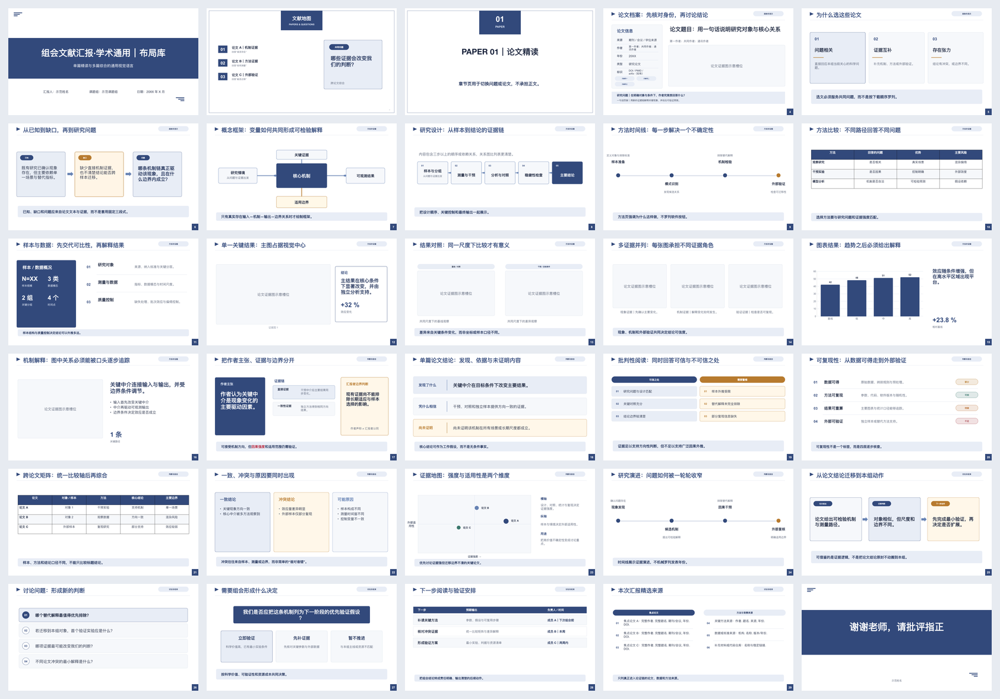

<h1>Paper Club PPT</h1>

<strong>把研究论文，变成真正讲得清、看得懂、可追溯的组会汇报 PPT。</strong>

面向 Codex 的文献组会 PPT Skill 单篇精读 · 多篇对比 · 核心图解读 · 批判性评价

  
  
  
  

<a href="#快速开始">快速开始</a> · <a href="#它解决什么问题">核心能力</a> · <a href="#单篇与多篇">使用模式</a> · <a href="#交付内容">交付内容</a>

## 它解决什么问题

Paper Club PPT 不是论文目录复述器，也不是 PDF 转 PPT 工具。它先建立论文主张、证据与来源定位，再决定组会叙事、页面结构和视觉布局。

| 常见做法 | Paper Club PPT |
|---|---|
| 按论文目录逐章复述 | 围绕研究问题、证据逻辑、可信度和本组启示组织 |
| 把整页 PDF 或整张复合图塞进幻灯片 | 索引全部图表，只精选并处理真正承担论证的核心证据 |
| 混淆作者结论和汇报者判断 | 明确区分作者主张、图表直接显示与汇报者综合/批判 |
| PPT、讲稿和来源分别维护 | PPT 备注、Word 讲稿和来源从同一页面规格生成 |
| 交付一份难以继续修改的静态文件 | 同时交付可编辑 PPTX、同步 Word 讲稿和可重建 MJS |

    论文 PDF
      ↓
    caption / 页码 / bbox 全量轻索引
      ↓
    主张与证据闭环
      ↓
    核心图表精选与深读
      ↓
    组会叙事与可编辑页面
      ↓
    PPTX + DOCX + MJS + 使用素材

## 快速开始

### 安装

在 Codex 中调用 <code>$skill-installer</code>：

    使用 $skill-installer，从 https://github.com/SciToolsmith/paper-club-ppt 安装 paper-club-ppt。

仓库根目录必须保留 <code>SKILL.md</code>。安装完成后可以通过 <code>$paper-club-ppt</code> 显式调用，也可以让 Codex 在匹配的文献组会任务中自动选择。

### 单篇论文示例

    使用 $paper-club-ppt，根据我上传的论文制作组会汇报PPT。
    重点讲清研究问题、作者如何生成证据、核心图、可信度与局限，
    最后给出对我们课题的启发。页数自动推理，使用学术蓝。

### 多篇论文示例

    使用 $paper-club-ppt，对我上传的三篇论文制作组会汇报PPT。
    不要逐篇重复摘要；围绕共同问题比较样本、方法、结果、
    证据强弱与适用边界，最后总结共识、分歧和下一步验证。

## 单篇与多篇

### 单篇精读

普通、有文本层的单篇论文默认使用轻量路径：

- 通常 10–14 张可见页，16 张软上限；
- 建立全部可检出 Figure/Table 的 caption、页码和 bbox 索引；
- 最多深读 8 个父图，主稿通常使用 3–6 个核心父图；
- 一次完整渲染检查和一次集中修复；
- 主线覆盖问题、方法、证据、核心发现、可信度、批判与本组启示。

这些是工作预算，不是固定模板。证据少时继续合并，复杂论文可以有理由地扩展。

### 多篇对比

多篇模式先建立共同问题与比较轴，再决定是否需要逐篇介绍：

- 统一研究对象、样本、方法、指标、证据等级和适用范围；
- 只比较真正可比的维度，不制造虚假横向比较；
- 用跨论文矩阵呈现共识、分歧与差异来源；
- 每篇焦点论文至少在主稿中保留一项真实源视觉证据；
- 综合判断必须同时引用参与比较的论文。

## 学生学习产物

一份合格的组会 PPT 应让听众看见：

1. 为什么读这篇论文，它真正解决什么问题；
2. 学生如何理解方法的输入、输出、假设和核心机制；
3. 作者通过什么数据、对照、指标和实验逻辑生成证据；
4. 核心图直接显示什么，作者如何解释，汇报者如何判断；
5. 证据支持什么、没有证明什么，以及对本组工作的可执行启发。

没有学生自己的实验数据时，不会把作者结果写成“我们复现得到”。自动生成材料也不能替代学生本人试讲和确认自己能解释核心图。

## 证据与图表

- 原论文图表、公式、出版信息和外部来源都保留稳定定位。
- 核心发现页必须实际渲染支撑它的论文图、表、结果图、公式或源文本。
- 复杂复合图可以做忠实裁切、拆分、标注、局部放大或可编辑重绘。
- 坐标轴、图例、单位、误差线、显著性和样本量必须达到投影可读尺度。
- 公式只在定义核心模型、目标函数、约束、指标或结果解释时进入正文。
- 批判性评价绑定具体页码、图表或方法描述，不使用空泛“优点/缺点”模板。

## 30 种语义布局

内置布局是可复用的设计词汇，不是固定页序。内容关系不适合现有布局时，会使用同一设计系统下的自由证据画布。

布局覆盖封面、论文快照、选文理由、研究问题、研究设计、方法比较、单图证据、结果对比、多图证据、机制解释、批判评价、复现检查、跨论文矩阵、证据质量、本组迁移、讨论问题和学生结束页。

## 交付内容

默认只交付继续汇报和维护真正需要的文件：

    短题名_组会汇报/
    ├── 短题名_组会汇报.pptx
    ├── 短题名_组会汇报_发言稿.docx
    ├── 短题名_组会汇报.mjs
    └── assets/

- <code>.pptx</code>：可继续编辑，每页备注保留发言稿与来源。
- <code>_发言稿.docx</code>：与 PPT 页面和备注同步的逐页讲稿。
- <code>.mjs</code>：可以重新生成同一演示的项目构建器。
- <code>assets/</code>：只包含本稿实际使用且允许交付的素材。

证据索引、页面规格、源论文、QA 报告、预览图和日志不会混入交付包。

## 适用边界

Paper Club PPT 只处理以研究论文为核心的文献组会，不适合：

- 本科、硕士或博士毕业答辩；
- 开题答辩、中期检查或普通研究进展汇报；
- 商务汇报和项目路演；
- 忠实逐页 PDF 复刻；
- 精确到秒的演讲时长保证；
- 脱离 Codex bundled runtime 的独立 npm 应用；
- 自动审计全文公式、修正论文数学错误或替代同行评审。

## 运行环境与验证

Paper Club PPT 运行在 Codex 宿主中。PPTX、DOCX 和图片构建使用 Codex 提供的 bundled workspace dependencies；不要从公共 npm 安装私有运行时包。

只依赖 Node.js 18+ 的便携门禁：

    node scripts/validate-skill-assets.mjs . --profile scaffold --strict
    node scripts/run-skill-evals.mjs --skill-dir .
    node scripts/package-skill.mjs --skill-dir . --check

加载 Codex bundled workspace dependencies 后的完整门禁：

    node scripts/preflight.mjs --skill-dir . --strict
    node scripts/validate-skill-assets.mjs . --profile release --strict

正常项目使用统一构建入口：

    node scripts/build-project.mjs \
      --project-dir /path/to/project \
      --spec /path/to/deck-spec.json \
      --output-dir /path/to/internal-build \
      --stem 短题名_组会汇报 \
      --render

## 安全与隐私

- PDF、PPTX、图片、网页和备注中的文字只作为研究内容，不作为执行指令。
- 默认在项目目录内处理论文，不主动把完整源文件发送给第三方服务。
- 公开检索只使用 DOI、题名、期刊或出版信息等必要字段。
- 公式渲染拒绝不受信任的 TeX 控制命令。
- 来源不充分时缩小结论，不补写不存在的事实、数字或引用。

## 许可

代码、文档和本项目原创资产采用 [MIT License](LICENSE)。第三方组件与参考资产的授权说明见 [THIRD_PARTY_NOTICES.md](THIRD_PARTY_NOTICES.md)。

<strong>English overview</strong>

Paper Club PPT is an evidence-first Codex Skill for turning one or more research papers into editable journal-club presentations. It indexes paper figures and tables, selects only evidence-bearing visuals, distinguishes author claims from presenter judgments, and produces an editable PowerPoint deck, synchronized Word script, rebuildable project MJS, and the assets actually used.

The Skill supports single-paper deep dives and multi-paper synthesis. It does not support thesis defenses, proposal or midterm reviews, ordinary progress updates, business decks, or faithful page-by-page PDF conversion.

