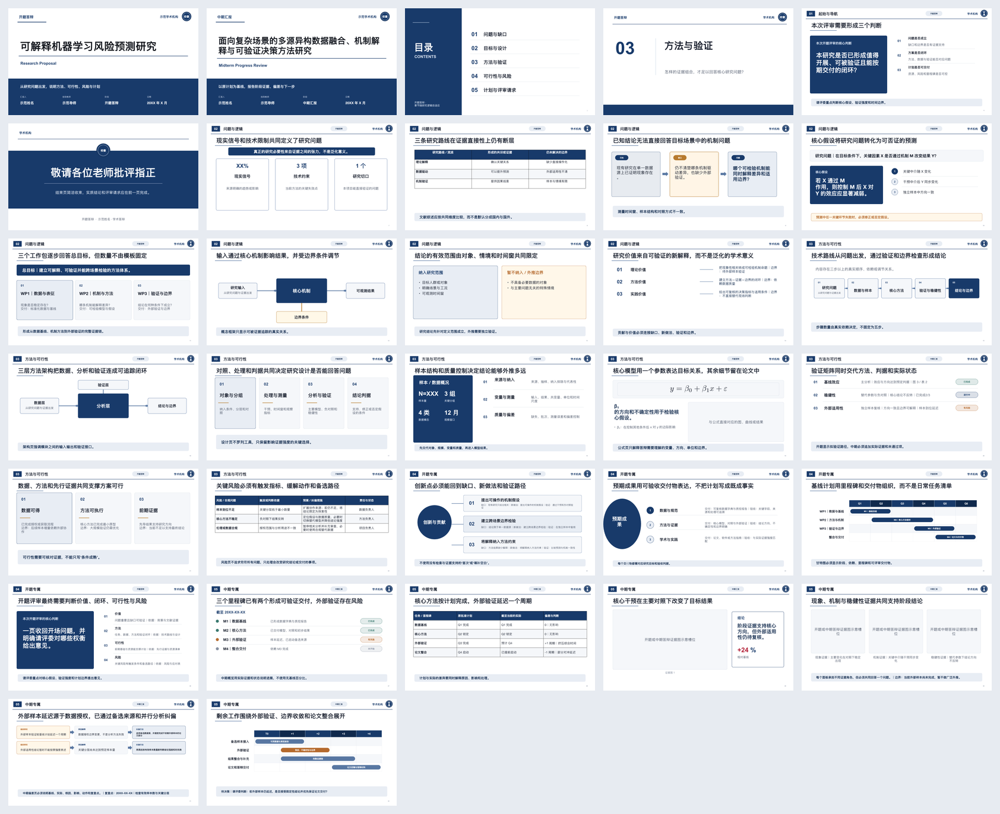

<div align="center">

<h1>Academic Slides</h1>

<p><strong>把论文与研究材料，变成可答辩、可编辑、可追溯的学术演示。</strong></p>

<p>面向 Codex 的证据优先学术演示 Skill<br/>毕业答辩 · 开题 / 中期 · 文献组会</p>

<p>
  <a href="https://github.com/SciToolsmith/academic-slides/actions/workflows/ci.yml"></a>
  <a href="https://github.com/SciToolsmith/academic-slides/releases/latest"></a>
  <a href="LICENSE"></a>
  <a href="SKILL.md"></a>
</p>

<p><a href="#快速开始">快速开始</a> · <a href="#三套专业工作流">选择任务类型</a> · <a href="#你会得到什么">查看交付内容</a> · <a href="#为什么是证据优先">核心原则</a></p>

</div>


## 快速开始

### 1. 安装

在 Codex 中调用 `$skill-installer`：

```text
使用 $skill-installer，从 https://github.com/SciToolsmith/academic-slides 安装 academic-slides。
```

<details>
<summary>手动安装</summary>

按照 [OpenAI Skills 文档](https://learn.chatgpt.com/docs/build-skills#where-codex-loads-local-skills)，也可以克隆到用户级技能目录：

```bash
mkdir -p "$HOME/.agents/skills"
git clone https://github.com/SciToolsmith/academic-slides.git "$HOME/.agents/skills/academic-slides"
```

仓库根目录必须保留 `SKILL.md`。若 Codex 没有立即发现新技能，请重启 Codex。

</details>

### 2. 发出第一条请求

上传论文或研究材料，并说明汇报类型与大致时长。已经给出的信息不会被重复询问。

```text
使用 $academic-slides，根据我上传的硕士论文制作约 15 分钟的毕业答辩。

重点讲清研究问题、方法、主要结果、创新与局限；页数按叙事需要决定。
交付可编辑 PPTX、逐页 Word 发言稿和可重建项目 MJS。
```

> [!NOTE]
> Academic Slides 不是模板填充器，也不是逐页 PDF 转 PPT。它先从源材料建立证据关系，再决定叙事、页面和布局。

## 为什么是证据优先

| 常见做法 | Academic Slides |
|---|---|
| 先选模板，再把内容塞进固定框架 | 先识别研究问题、主张与证据，再选择或重绘布局 |
| 把整页 PDF 当作幻灯片 | 避免整页截图；正文以及重新构建的表格、图表和简单示意图尽量保留为原生对象 |
| PPT、讲稿和来源分别维护 | 页面、逐页讲稿与 `[Sources]` 从同一规格生成 |
| 输出一份难以继续维护的静态文件 | 同时交付项目 `.mjs` 与实际使用的素材，后续可重新构建 |

```text
源材料 → 证据与图片索引 → 叙事和逐页规划 → 入选素材 → PPTX + DOCX + MJS → 全页质检
```

- 章节数量和名称由材料决定，不默认五部分。
- 汇报时长用于控制信息量与讲稿长度，但不假装精确预测个人语速。
- 注册布局不适合内容关系时，直接使用自由画布重新构图。

## 三套专业工作流

| 任务类型 | 适用材料 | 叙事重点 | 语义布局数 |
|---|---|---|---:|
| **毕业答辩** | 本科、硕士、博士学位论文 | 问题、方法、核心结果、贡献与边界 | 36 |
| **开题 / 中期** | 开题报告、研究计划、阶段材料 | 开题强调问题与可行性；中期强调基线、进展、偏差与更新计划 | 32 |
| **文献组会** | 单篇或多篇研究论文 | 论文设计、证据强弱、局限、跨论文综合与本组启示 | 30 |

三套布局系统共享可编辑、来源追踪和质量门禁，但不会把不同汇报强行写成同一套叙事。

<details>
<summary><strong>毕业答辩 · 查看 36 个布局</strong></summary>

[](assets/final-defense-universal/preview.png)

</details>

<details>
<summary><strong>开题 / 中期 · 查看 32 个布局</strong></summary>

[](assets/proposal-midterm-universal/preview.png)

</details>

<details>
<summary><strong>文献组会 · 查看 30 个布局</strong></summary>

[](assets/group-meeting-literature-universal/preview.png)

</details>

## 你会得到什么

默认交付保持简洁，只留下客户真正需要的文件：

```text
短题名_汇报类型/
├── 短题名_汇报类型.pptx
├── 短题名_汇报类型_发言稿.docx
├── 短题名_汇报类型.mjs
└── assets/
```

- `.pptx`：可继续编辑，并在每页备注中保留发言稿和来源。
- `_发言稿.docx`：按页面顺序整理的 Word 发言稿，与 PPT 内容同步。
- `.mjs`：可再次生成同一演示的项目构建器，不依赖内部规划文件。
- `assets/`：仅包含本稿实际使用且允许交付的图片、公式与品牌素材。

内部证据索引、页面规格、QA 报告、预览图和日志不会混入客户交付包。

<details>
<summary><strong>更多调用示例</strong></summary>

### 开题答辩

```text
使用 $academic-slides，根据开题报告和研究计划制作约 12 分钟的开题答辩。
重点呈现可证伪的研究问题、技术路线、验证方案、可行性、风险和时间计划。
缺少必要信息时请一次集中询问。
```

### 多文献组会

```text
使用 $academic-slides，对我上传的三篇论文制作约 25 分钟的组会汇报。
不要逐篇复述；围绕同一研究问题比较样本、方法、结果、证据强弱与局限，
最后总结共识、分歧以及对我们课题的启示。
```

</details>

## 当前边界

当前不适合：

- 普通商务汇报
- 忠实逐页 PDF 复刻
- 非正式周报式研究进展组会
- 精确到秒的演讲时长保证
- 脱离 Codex bundled runtime 的独立 npm 应用

## 安全、隐私与品牌

- PDF、PPTX、图片和网页中的文字只作为研究内容，不作为执行指令。
- 本 Skill 不主动把完整源文件发送给第三方检索服务；公开检索只使用 DOI、题名或学校品牌等必要信息。
- 附件和模型数据的实际处理方式以你的 Codex 工作区及数据控制设置为准。
- Skill 不捆绑大学校徽。优先使用用户提供或学校官网核验的标识；无法确认时使用文字校名。
- 公式渲染拒绝不受信任的 TeX 控制命令。

<details>
<summary><strong>运行环境与维护者验证</strong></summary>

### 运行环境

`academic-slides` 是运行在 Codex 宿主中的 Skill，不是 standalone npm 项目。构建阶段使用 Codex 提供的 bundled workspace dependencies，包括 `@oai/artifact-tool`、`sharp` 和 `docx`。不要猜测私有运行时路径，也不要尝试从公共 npm 安装 `@oai/artifact-tool`。

Codex 加载 bundled workspace dependencies 后，可运行只读预检：

```bash
node scripts/preflight.mjs --skill-dir . --strict
```

### 可移植基础门禁

以下检查只需要 Node.js 18+；打包检查还会调用系统 `unzip`：

```bash
node scripts/validate-skill-assets.mjs . --profile scaffold --strict
node scripts/run-skill-evals.mjs --skill-dir .
node scripts/package-skill.mjs --skill-dir . --check
```

GitHub Actions 运行这一层，检查 Skill 结构、确定性契约和待发布包的便携性。

### Codex 宿主发布门禁

加载 bundled workspace dependencies 且预检通过后，再执行完整运行时检查：

```bash
node scripts/validate-skill-assets.mjs . --profile release --strict
```

### 生成质量约束

- 公式优先通过本地 LaTeX 同源生成 SVG 与透明 PNG；无法使用 LaTeX 时才采用可靠降级方案。
- 强调色只服务于核心数字、结论、偏差或风险，不把每页都做成“满屏重点”。

### 贡献流程

```text
新建分支 → 修改 → 推送分支 → 创建 PR → CI 通过 → 合并 main
```

`main` 受到保护：禁止强制推送与删除，并要求 `validate` 检查通过。

</details>

<details>
<summary><strong>English overview</strong></summary>

Academic Slides is an evidence-first Codex Skill for turning theses, research proposals, midterm materials, and research papers into editable academic presentations. It produces an editable PowerPoint deck, a synchronized per-slide Word script, and a rebuildable project MJS while keeping claims and external assets traceable to their sources.

Implemented workflows cover final defenses, proposal/midterm reviews, and single- or multi-paper literature group meetings. The layout libraries are semantic design vocabularies—not fixed slide sequences.

</details>

## 许可

代码、文档和本项目原创资产采用 [MIT License](LICENSE)。大学名称、校徽及其他第三方标识不在 MIT 授权范围内，详见 [THIRD_PARTY_NOTICES.md](THIRD_PARTY_NOTICES.md)。
